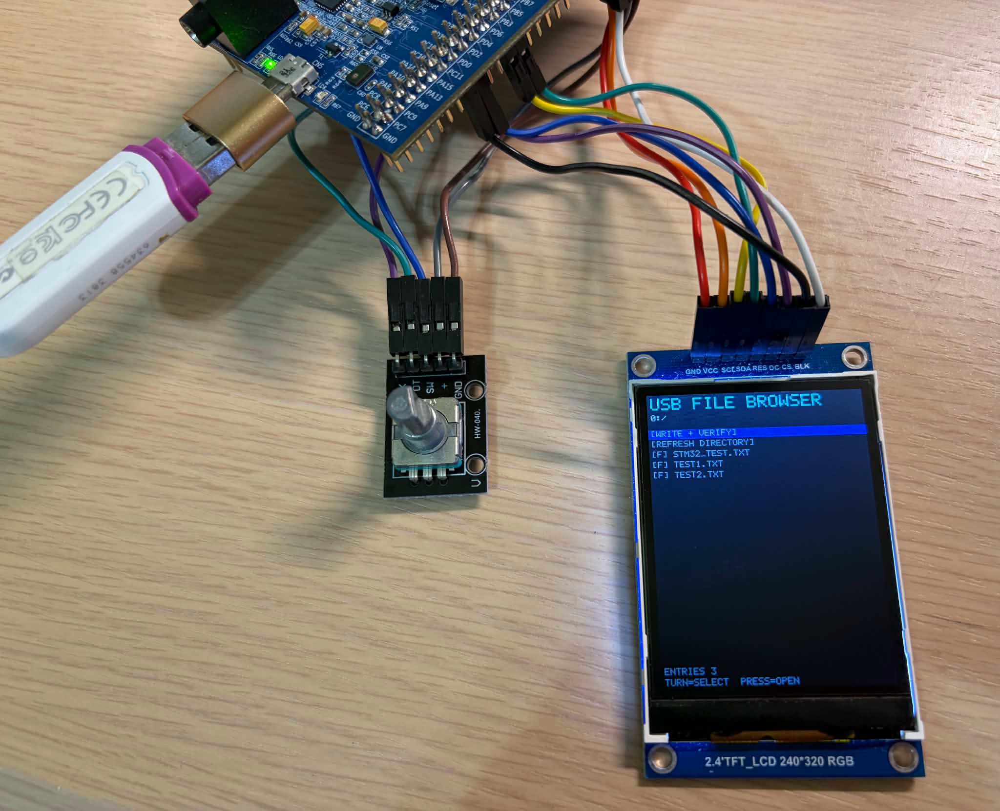

# USB Filesystem Read/Write Test

This is a USB mass-storage test application. After plugging in a USB flash drive (formatted as FAT32 with MBR partition table) to the CN5 USB-OTG connector, it can use the ILI9341 display to show the directory, read text files, and run a write/verify test, controlled by the HW-040 rotary encoder.

## Features

- Mounts, browses, and safely unmounts one USB MSC drive.
- Lists up to 64 items in a directory, with scrolling and parent-directory
  navigation.
- Displays folder and file indicators; long filenames are truncated to fit the
  display.
- Opens printable `.txt` files in a 256-byte paged preview.
- Shows mount, read, write, verification, and disconnect errors on the TFT.
- Provides a `[WRITE + VERIFY]` test. It only creates or replaces
  `STM32_TEST.TXT` in the USB drive's root directory with a 1 KiB readable test
  pattern, calls `f_sync()`, reopens the file, and compares every byte.
- Detects USB removal and returns to the waiting screen. It can be reinserted
  and mounted again.

## Hardware

| Part | STM32F407G-DISC1 connection |
| --- | --- |
| ILI9341 SCL | PB3 / SPI1_SCK |
| ILI9341 SDA | PB5 / SPI1_MOSI |
| ILI9341 CS, DC, RESET | PD0, PD1, PD2 |
| HW-040 CLK, DT | PE9 / TIM1_CH1, PE11 / TIM1_CH2 |
| HW-040 switch | PE13, active-low |
| USB flash drive | CN5 through a USB-A-to-micro-USB OTG adapter |
| Debug/programming cable | CN1 on-board ST-LINK |

The display and encoder wiring details are also recorded in the repository-wide
`AGENTS.md`.

## STM32CubeMX configuration

The project was generated for the STM32F407G-DISC1 board with the CMake
toolchain. The relevant configuration is:

- HSE set to BYPASS.
- SPI1 transmit-only master on PB3/PB5 for the ILI9341.
- TIM1 encoder mode TI12 on PE9/PE11 for the HW-040. Both input filters set to 15, which is important for rotation debouncing. PE13 pull-up for the switch press.
- USB OTG FS configured as Host only, with USB Host MSC middleware enabled.
- FatFs configured with the USB disk driver and long filename support.

## Application code

The project-specific code is deliberately small and uses STM32 HAL APIs only.

| File | Role |
| --- | --- |
| `Core/Src/app.c`, `Core/Inc/app.h` | USB readiness/mount state machine, filesystem browser, text preview, write/reopen/compare test, and TFT UI. |
| `Core/Src/encoder.c`, `Core/Inc/encoder.h` | Starts TIM1 encoder counting, converts filtered quadrature counts into navigation steps, and debounces the PE13 press. |
| `Core/Src/tft.c`, `Core/Inc/tft.h` | Compact ILI9341 SPI driver, rectangle drawing, and printable-ASCII text rendering. |
| `Core/Src/main.c` | CubeMX-generated startup with `app_init()` after generated peripheral initialization and `app_poll()` after `MX_USB_HOST_Process()`. |
| `USB_HOST/Target/usbh_platform.c` | CubeMX target hook corrected for the Discovery board's active-low USB VBUS power switch. |
| `CMakeLists.txt` | Includes the three project-specific source modules in the CMake target. |
